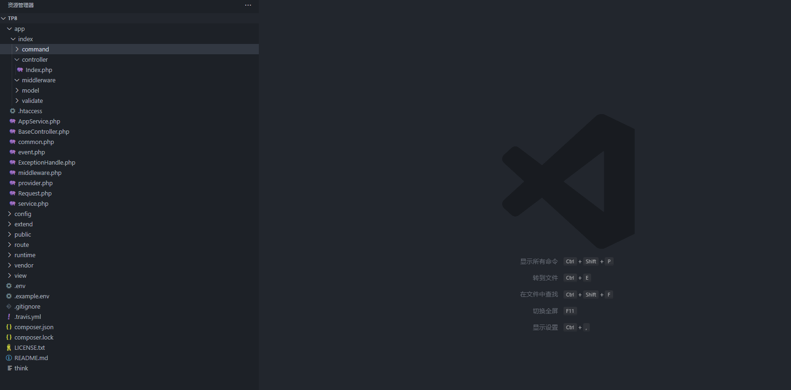
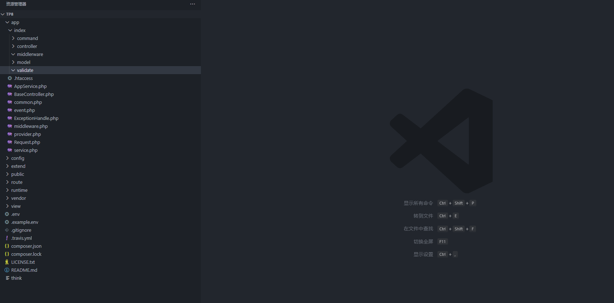
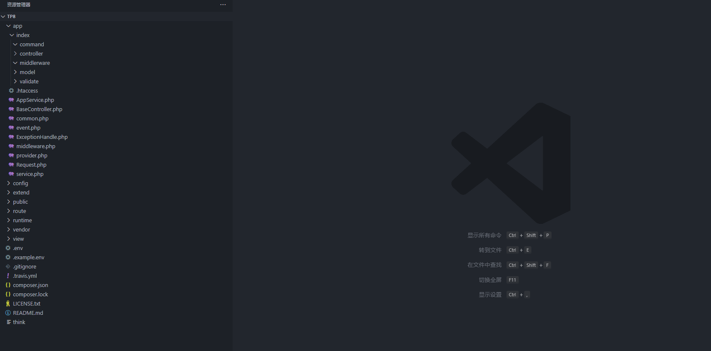
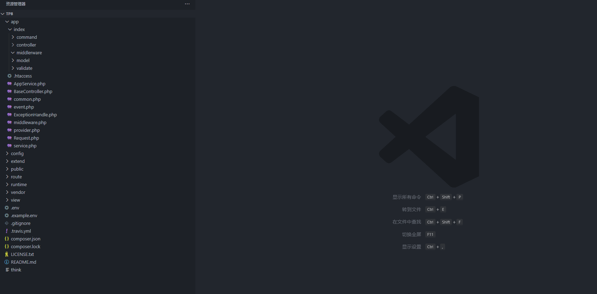
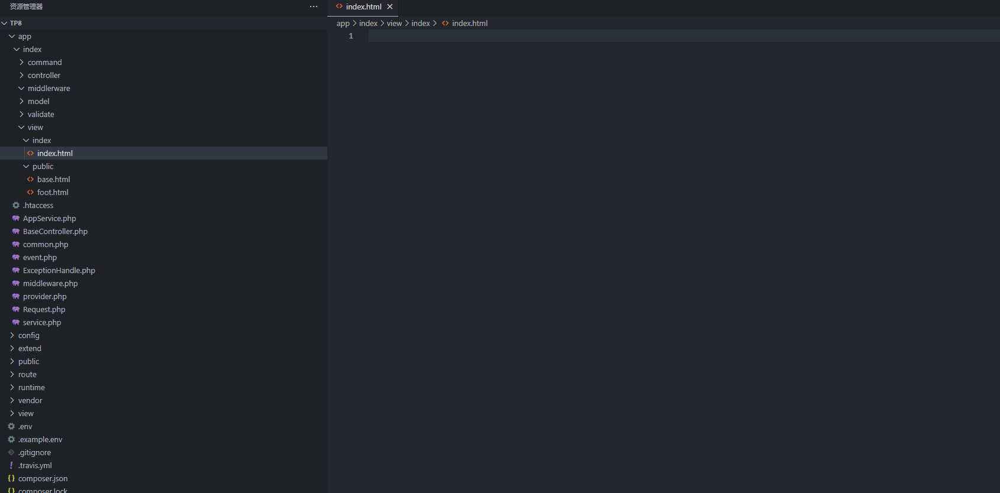
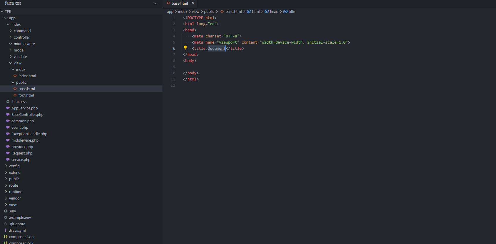
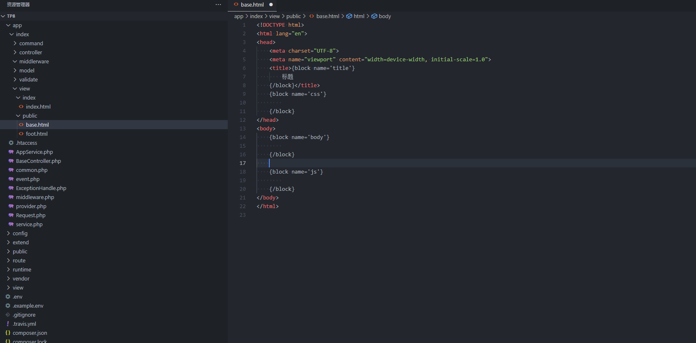
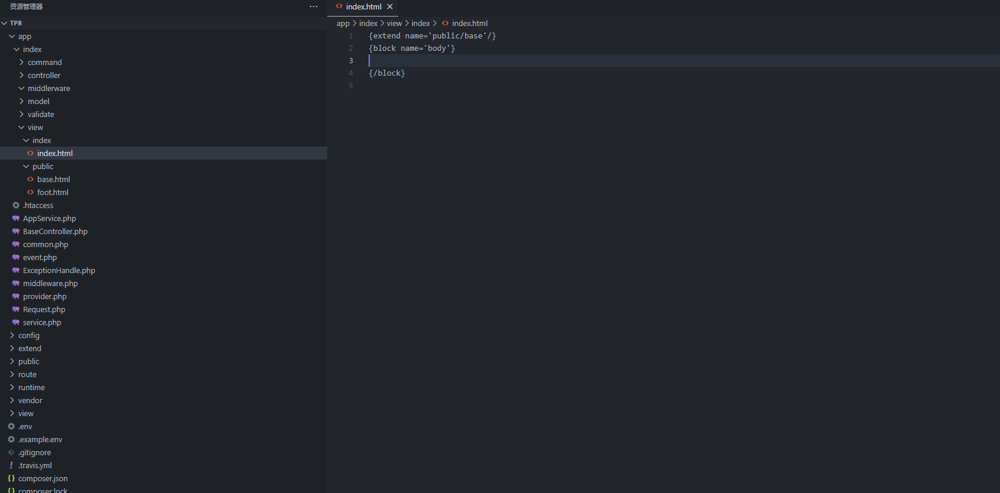

# vscode-tp6-snippets
ThinkPHP代码片段,版本>=6

## 自动生成php代码
- `tpcontroller` 生成控制器类
  
- `tpmodel` 生成模型类
  
- `tpvalidate` 生成验证器类
  
- `tpcommand` 生成命令行类
  
- `tpmiddleware` 生成中间件类
  
- `tpevent` 生成事件类
- `tplistener` 生成监听器类
- `tpservice` 生成服务类
- `tpsubscribe` 生成订阅器类
- `tpphp` 生成普通php

> 如果头部有`<?php`执行以下快捷命令

- `controller` 生成控制器类
- `model` 生成模型类
- `validate` 生成验证器类
- `command` 生成命令行类
- `middleware` 生成中间件类
- `event` 生成事件类
- `listener` 生成监听器类
- `service` 生成服务类
- `subscribe` 生成订阅器类
- `php` 生成普通php

## html中自动生成模板片段

- `extend` 生成`extend`标签, 默认继承`public/base`模板
  
- `block` 生成`block`标签
  
- `include` 生成`include`标签
  
- `volist` 生成`volist`标签
  
- `foreach` 生成`foreach`标签
  
- `for` 生成`for`标签
  
- `eq` 生成`eq`标签
- `neq` 生成`neq`标签
- `heq` 生成`heq`标签
- `nheq` 生成`nheq`标签
- `gt` 生成`gt`标签
- `egt` 生成`egt`标签
- `lt` 生成`lt`标签
- `elt` 生成`elt`标签
  
- `switch` 生成`switch`标签
  
- `if` 生成`if`标签
  
- `in` 生成`in`标签
- `notin` 生成`notin`标签
- `between` 生成`between`标签
- `notbetween` 生成`notbetween`标签
  
- `present` 生成`present`标签
- `notpresent` 生成`notpresent`标签
- `empty` 生成`empty`标签
- `notempty` 生成`notempty`标签
- `defined` 生成`defined`标签
- `load` 生成`load`标签
- `assign` 生成`assign`标签
- `define` 生成`define`标签
